# Compose domain specific bots using an agent bot
A domain specific bot addresses queries related to a specific domain or topic. Some examples are - Travel bot(Travel related conversations), Weather bot (Weather related conversations). 

If a user wants to have a cross-domain conversation, then the user will have to switch between the different bots. 

There are scenarios where an user wants to have a conversation involving multiple domains.
For example - When I want to travel to a place, I want to query for the weather and then book a cab or flight. I might have to end up switching between two bots, weather bot and travel bot. What if I could just have one interface bot which will redirect my messages to a specific bot and get answers to me? 

Well, this code pattern showcases an implementation of this approach.

The solution here is to have an agent bot (or an interface bot) and a few other bots which can handle conversations for a specific domain - let's call these specific bots. The agent bot knows about the specific bots and also about which domain each of them can handle. When user initiates conversation with agent bot, the agent bot will understand the intent of user query and it will redirect the user query to a specific bot. Subsequent requests from user are redirected to specific bot. When the conversation with the specific bot is over or when the specific bot is not able to handle the request, the control is given back to agent bot which will then redirect the messages to appropriate bot.

This approach provides seamless experience for users. It can be used by organisations which provide a host of services to its customers like financial services, tours and travel agencies, news agencies etc..

Advantages with this approach are:
- Plug and play the bots
- Modular approach facilitates Bots composition
- Come up with new services by composing two or more Bots
- Easy to maintain, make changes, add/remove functionalities
- Easy to troubleshoot issues
- Transparent to user

In this code pattern we will use Watson assistant Bot for building Bots and Node.js application as orchestration layer.

When the reader has completed this Code Pattern, they will understand how to:

* How to configure a bot to make it Agent Bot
* How to configure a specific bot to return control to Agent Bot
* How to build an orchestration layer to stitch Agent Bot and specific Bots

## Flow

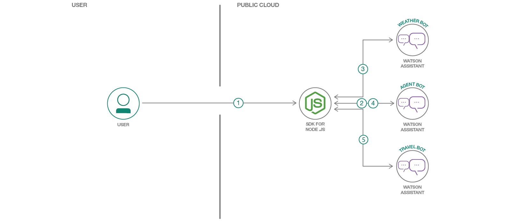

1. User accesses web application and types in a message. Nodejs application, an orchestration later, sends user message to agent bot
2. Agent bot determines the intent of the message and responds with the specific bot details, to which the message needs to be redirected.
3. Node.js application sends message to the specific bot (Weather Bot, in this case). Specific bot responds. Conversation continues between user and specific bot.
4. When the conversation with specific bot is over, user message is then sent to agent bot to determine the intent.
5. Node.js application sends message to the specific bot (Travel Bot, in this case). Specific bot responds. Conversation continues between user and specific bot.


# Watch the Video
Coming soon

# Steps
1. Clone git repo
2. Create bots.
3. Configure application with bots details.
4. Deploy application to IBM Cloud.
5. Run application.

## 1. Clone git repo

- On command prompt run the below command to clone the git repo.
```
git clone git@github.com:IBM/watson-assistant-multi-bot-agent.git
```
or
```
git clone https://github.com/IBM/watson-assistant-multi-bot-agent.git
```
run `cd watson-assistant-multi-bot-agent` to change directory to project parent folder


## 2. Create bots

### 2.1 Create Watson Assistant service instance
- Click this [link](https://console.bluemix.net/catalog/services/watson-assistant-formerly-conversation) to create Watson assistant service.
- Enter the service name as `wbc-Watson Assistant (formerly Conversation)-bots`. You can choose to enter any name you like.
- Ensure you select the right region, organisation and space.
- Under `Pricing Plans`, select `Lite` plan.
- Click `Create`.
- Watson Asistant service instance should get created.

### 2.2 Import bots
- Go to IBM Cloud dashboard and click on the Watson Assistant service instance created in above steps.
- On the Assistant Dashboard, click `Launch Tool`.


- Click `Workspaces` tab.

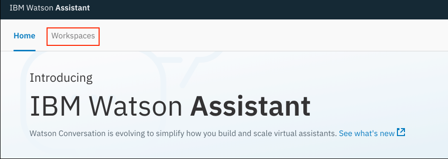

- Click `Import workspace` button.

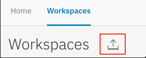

- Click on `Choose a file`.
- Browse to the cloned repository parent folder -> WA.
- Select `agent-bot.json` and click `Open`.
- Under `Import`, select the option `Everything (Intents, Entities, and Dialog)`.


- Click `Import` button.
- Repeat above steps in section [Import bots](#22-import-bots) to import `travel_bot.json` and `weather_bot.json`.

## 3. Configure application with bots details

### 3.1 Gather required details

- Go to IBM Cloud dashboard and click on the Watson Assistant service instance.
- On the Assistant Dashboard, click `Launch Tool`.
- Click `Workspaces` tab.
- On `agentBot` click `actions`, the three vertical dots on the top right corner.

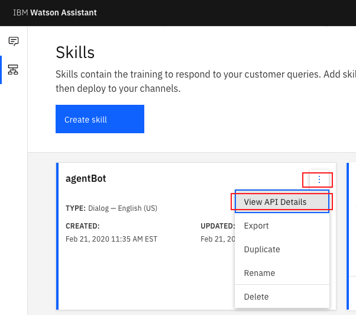

- Click `View Details`.
- Copy and save workspace id for later use.
- Repeat above steps in section [Configure application with bots details](#3-configure-application-with-bots-details) for all the other bots also.
- Go to IBM Cloud dashboard and click on the Watson Assistant service instance.
- Click `Service Credentials` on the left hand navigation bar.

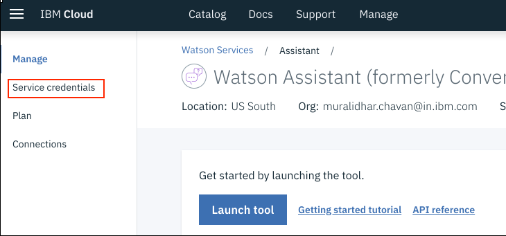

- Click on `View Credentials`.


- Copy `url`, `username` and `password` and save them for later use.

### 3.2 Update manifest.yml file with the details gathered

- Under project parent folder, open `manifest.yml` file for editing.
- Update username, of Watson Assistant service instance as noted in section [Gather required details](#31-gather-required-details), against ASSISTANT_USERNAME
- Update password, of Watson Assistant service instance as noted in section [Gather required details](#31-gather-required-details), against ASSISTANT_PASSWORD
- Update workspace ids, as noted in section [Gather required details](#31-gather-required-details), against respective bots

Updated `manifest.yml` file looks as below


## 4. Deploy application to IBM Cloud
- On command prompt, navigate to project parent folder
- On command prompt, login to IBM Cloud using `ibmcloud login` or `ibmcloud login --sso` (for federated login).
- Ensure that you are in the right organisation, space and region using the below command.
```
ibmcloud target
```
- Run the below command to deploy the application to IBM Cloud.
```
ibmcloud cf push
```
- Check the logs of the application using the command `ibmcloud cf logs <app_name> --recent`.
- Ensure that the application is deployed to IBM Cloud successfully. If you see any errors in logs, fix them and redeploy the application.


## 6. Run the application
- On a browser, Login to IBM Cloud and go to dashboard. There you will see that the application is deployed and running.
- Click on the application and click on `Visit App URL`.


- The application home page opens.

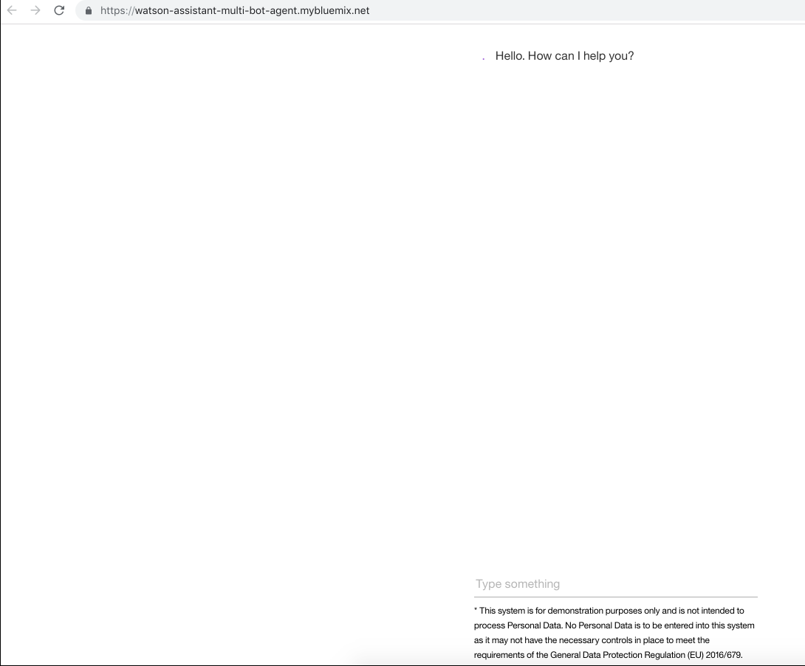

- On command prompt monitor logs using the command
```
ibmcloud cf logs watson-assistant-multi-bot-agent
```

- On the application home page type a weather related query `What does the weather look like tomorrow?`.
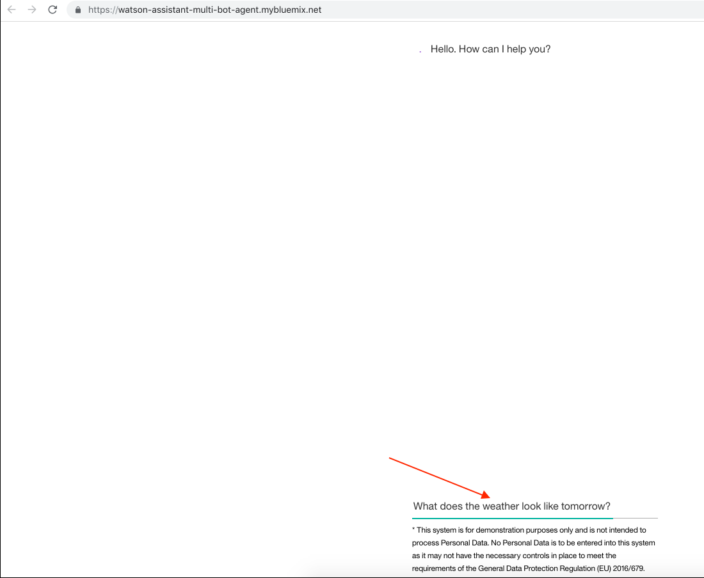
- Check the log files and notice that the message first goes to Agent Bot and then it is redirected to the Weather Bot.
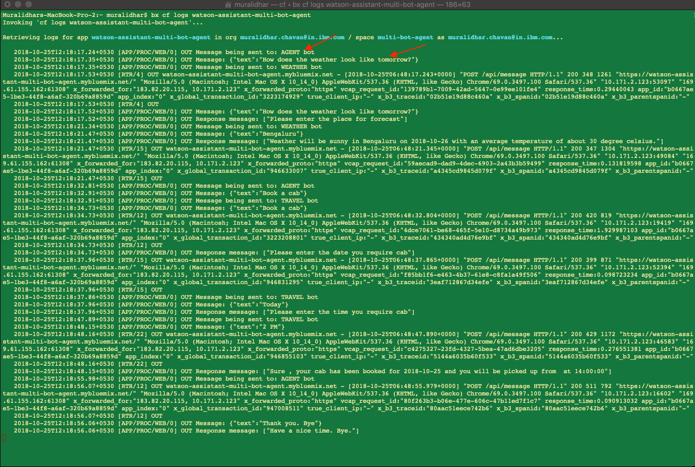
- In the interface, you are asked to enter the location. Enter a location, e.g. `Bengaluru`.
- Check the logs. Because the conversation with the Weather Bot has not ended, subsequent messages are sent to the Weather Bot itself, without the intervention of the Agent Bot.

- The Weather Bot responds with an answer to user query and hence conversation with Weather Bot is treated as ended.
- Next user enters a travel related query `Book a cab`.
- In the logs, notice that the message is sent to Agent Bot and then it is redirected to Travel Bot.
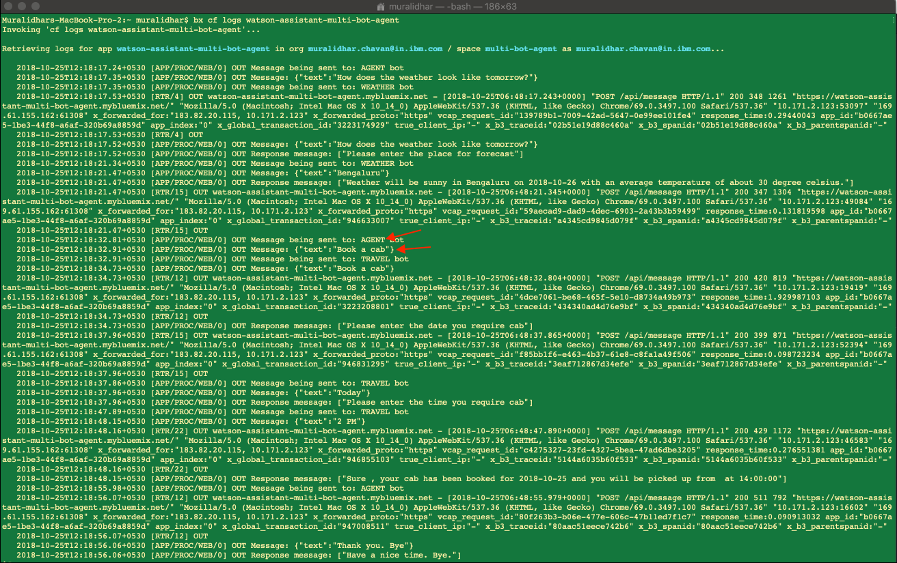
- In the interface you are asked to enter a date for cab booking. Enter a date or you can just say `Today`.
- Check the logs. Because the conversation with the Travel Bot has not ended, subsequent messages are sent to the Weather Bot itself, without the intervention of the Agent Bot.
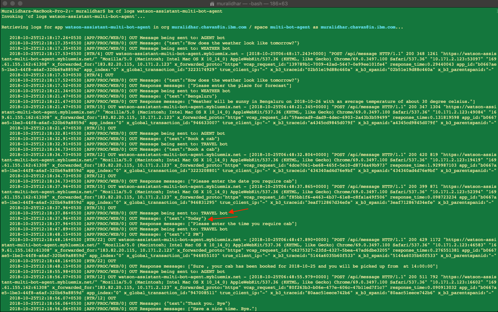
- In the interface you are asked to enter time for the cab to arrive. Say `12 PM`.
- Check the logs. Travel Bot responds with an answer. The conversation with Travel Bot has ended.
- The above conversation flow can continue and the Agent Bot will redirect the messages to specific bots based on the intent of user query
- Some of the basic messages as greetings and bye can be handled by Agent Bot itself.
- In the interface type `Thank you. Bye`

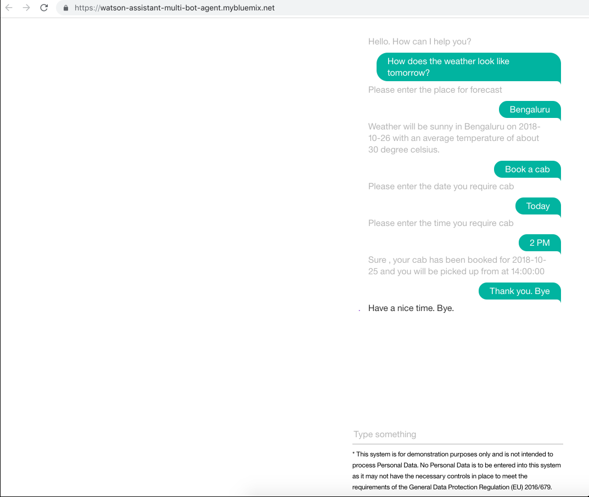

- Overall Flow of messages between bots is as shown in the below diagram


Legend for above image
1. Message sent to Agent Bot.
2. Message redirected to Weather Bot.
3. Response from Weather Bot.
4. Message sent to Weather Bot.
5. Response from Weather Bot (end of conversation with Weather Bot).
6. Message sent to Agent Bot.
7. Message redirected to Travel Bot.
8. Response from Travel Bot.
9. Message sent to Travel Bot.
10. Response from Travel Bot.
11. Message sent to Travel Bot.
12. Response from Travel Bot (end of conversation with Travel Bot).
13. Message sent to Agent Bot.
14. Response from Agent Bot (end of conversation).


# Plug and play process for a new bot

1. To add a new bot, create a new bot in the Watson Assistant service instance created earlier for this code pattern or you can use an existing bot that you want to use. Let's say you added a bot for `Restaurant Booking` and named it as `RESTAURANT_BOOKING`.
2. In `manifest.yml` file, add an entry for new bot as shown below
```
WORKSPACE_ID_RESTAURANT_BOOKING: xxxxxxxxxxxxxxxxxxxxxxxx
```
3. In the RESTAURANT_BOOKING Bot, when the conversation is over (last node in a dialog), add a context parameter `destination_bot` and value as `AGENT`. It enables the control to be passed to back to the Agent Bot. You can refer to the leaf nodes in other already imported bots for examples.
4. Open Agent Bot. Add an intent for Restaurant Booking, say restaurant. Then in dialog, add a node for restaurant intent. Add a context parameter `destination_bot` and value as `RESTAURANT_BOOKING`.
5. Redeploy the application for the configuration changes to take effect.
6. That's it, you are set to you new `RESTAURANT_BOOKING` bot as a plug and play bot.


# Summary
We introduced an Agent Bot which understands intents of messages. Agent Bot will redirect a message to a specific bot which can handle that message. We saw how to configure Agent Bot, Specific Bots and orchestration application to have this arrangement possible. We also saw how to plug and play this setup to add a new bot.


# Troubleshooting

* The application page displays but there is no greetings message, when the application pages loads.
  * Verify Watson Assistant username and password are correct.
  * Verify workspace_id of the agent bot is correct.

* No response for a chat message
Verify workspace_id of a specific bots is correct.

* If there is any other issue, check application logs using the below command
```
ibmcloud cf logs <app-name> --recent
```


# License
[Apache 2.0](LICENSE)
